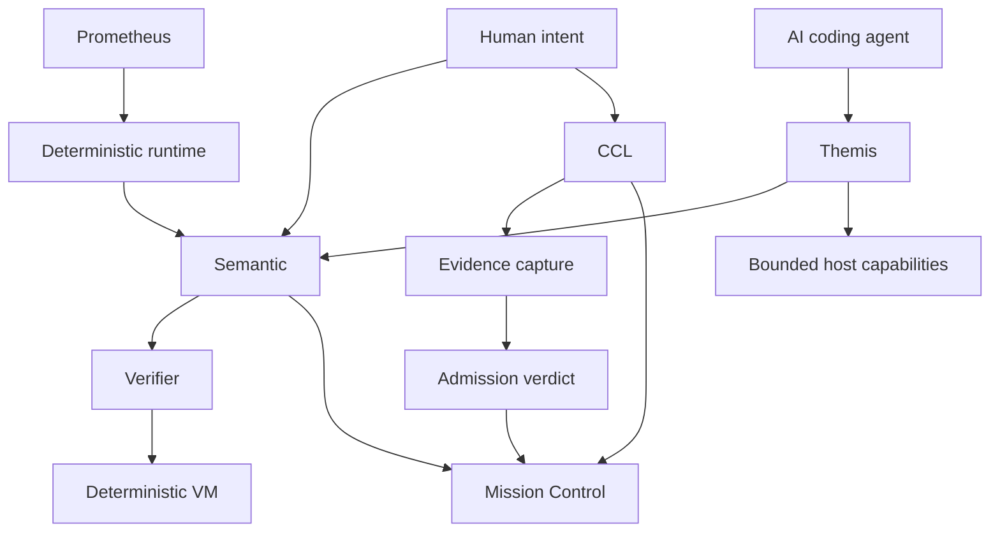

<div align="center">

# Said Kulmakov

### Systems Architect · Creator of Semantic

**Designing deterministic, verifier-first systems for reasoning,  
controlled execution and evidence-driven AI-agent governance.**

<br>

`Meaning before execution.`  
`Evidence before admission.`  
`Authority through explicit contracts.`

<br>

[](https://github.com/skulmakov-oss/Semantic)
[](https://github.com/skulmakov-oss/Semantic)
[](https://github.com/skulmakov-oss/Semantic)

</div>

---

## Semantic

[**Semantic**](https://github.com/skulmakov-oss/Semantic) is a deterministic, verifier-first language platform for reasoning programs and explicit four-state logic.

It compiles human-readable `.sm` source into versioned **SemCode**, verifies the artifact at a dedicated admission boundary, and executes admitted code in a deterministic virtual machine.

```text
.sm source
   → frontend and semantic analysis
   → deterministic IR
   → SemCode (.smc)
   → verifier admission
   → deterministic VM
   → capability-controlled host boundary
```

Semantic treats uncertainty and contradiction as explicit computational states:

| State | Meaning |
|:---:|---|
| `N` | insufficient evidence / unknown |
| `F` | false |
| `T` | true |
| `S` | conflicting evidence |

> A result is not admitted because an agent claims success.  
> It is admitted only when the required evidence exists.

---

## Ecosystem

| Project | Responsibility |
|---|---|
| [**Semantic**](https://github.com/skulmakov-oss/Semantic) | Language, compiler, semantic analysis, SemCode verifier and deterministic VM |
| [**CCL**](https://github.com/skulmakov-oss/CCL) | Deterministic governance and evidence-based admission for AI-agent software engineering |
| [**Themis**](https://github.com/skulmakov-oss/Themis) | MCP contract runtime with verified state transitions and bounded capabilities |
| [**Mission Control**](https://github.com/skulmakov-oss/Mission-Control) | Live 3D observability for semantic graphs, contracts, effects, conflicts and verdicts |
| [**Prometheus**](https://github.com/skulmakov-oss/Prometheus) | Experimental Rust `no_std` operating-system foundation with deterministic event routing |
| [**Admission Guardian**](https://github.com/skulmakov-oss/Admission-Guardian) | Local validation and admission boundary under active development |
| [**Semantic TextMate Grammar**](https://github.com/skulmakov-oss/semantic-textmate-grammar) | Editor syntax support for the Semantic language |



---

## Engineering Principles

```text
Verifier first
Deterministic execution
Explicit uncertainty and conflict
Least authority
Evidence over testimony
Bounded effects
Canonical meaning separated from presentation
```

These principles are applied across the ecosystem:

- **Reasoning is explicit.** Unknown and contradictory evidence are not silently collapsed into Boolean values.
- **Execution is admitted.** Raw artifacts do not enter the canonical runtime path without verification.
- **Authority is bounded.** Components receive only the capabilities required for the current state.
- **Evidence is structural.** Agent confidence and natural-language reports are not treated as proof.
- **Presentation is not meaning.** Visual and UI layers project canonical state rather than becoming the source of truth.

---

## Current Focus

- Semantic language and deterministic runtime
- Compiler, verifier and virtual-machine boundaries
- Semantic UI and application architecture
- Executable contracts for AI coding agents
- Evidence-backed engineering workflows
- Semantic graph observability and deterministic replay
- `no_std` runtime and systems architecture research

My industrial engineering background keeps this work grounded in real systems: constraints, failure modes, observability, bounded operations and controlled recovery.

---

## Technical Domains

`Rust` · `no_std` · `Compiler Design` · `Virtual Machines` · `Formal Boundaries`  
`MCP` · `AI-Agent Governance` · `Evidence Systems` · `Semantic Graphs`  
`TypeScript` · `React` · `Tauri` · `Three.js` · `Systems Engineering`

---

<div align="center">

### The system may propose. The verifier decides.

[Explore Semantic](https://github.com/skulmakov-oss/Semantic) ·
[View CCL](https://github.com/skulmakov-oss/CCL) ·
[Open Mission Control](https://github.com/skulmakov-oss/Mission-Control)

</div>
